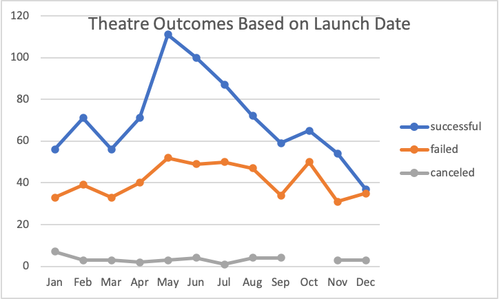
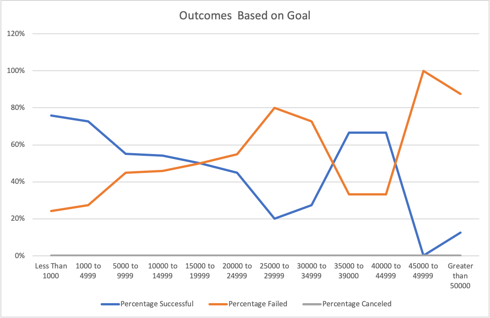

# An Analysis for a Kickstarter Campaign
## Overview of Project
  * The purpose of this project was to examine data and provide analysis to a client wishing to compare and contrast the results of campaigns similar to the clients own personal endeavors (That being, how "Theaters" and "Plays" campaign fared throughout the world).  Through the collection of data from various campaigns across the world from the years 2009 to 2017, this project was able to provide two analytical observations that helped the client better understand the outcomes based on the launch dates of these campaigns, as well as the outcomes of goals by these campaigns. Filters were used to adjust accordingly to the data most relevant to the client's preference for the campaign (Those filters being "Theaters" and "Plays", also "years grouped by months") .
 ### Analysis and Challenges
  1. **Analysis** -	As previously noted, the analysis stage of this project was obtainable through the data collected from previous campaigns. This data when implemented into our Kickstarter data set in Excel allowed for an in-depth observation in how these campaigns fared. Data sets such as the success rate, failed rate, and cancellation rate of certain campaigns help visualize and create an idea of an ideal campaign based on trends. The succession, failure, or cancellation of a campaign had a correlation to whether or not these campaigns met their intended monetary goal. The pledges made by doners determined if the goal was met.

* Image 1 (Theater Outcomes vs Launch) is a pivot chart that uses data from the Kickstarter data set to help visualize campaign outcomes of success, failed, and canceled, based on filters. The filters are set to show the target campaign or parent category which was “Theaters” and the timeframe of these campaigns from 2009 to 2017 grouped by months.  
 * Image 2 (Outcomes vs Goals) was more technical with the usage of code to determine the outcomes of campaigns based upon a range of goals listed in the data set. A “CountIFS” line of code was used to differentiate and sort out the number of successful, failed, and canceled campaigns based on the varying ranges of goals. The dependent variable of the line of code for the “CountIFS” was the subcategory of for plays. Also depicted in the image are the percentages of success, failed, and cancelled campaigns that was determined by the division of the outcome to the total amount of projects in regard to the range of goal. The total amount of projects in relation to the range of goals was calculated simply through the “Sum” function of the number of projects in the successful, failed, and cancelled columns.  
2. **Challenges** - Challenges that I encountered during this process was being precise in making sure all parameters of my code were spot on to provide the correct results. One miscue and your pivot chart are wrong. Thus, it was an early struggle figuring out why my line chart did not look the same as the provided correct example. By reaching out to peers for what I could be doing wrong in my code, I was able to realize my inability to read precisely the instruction to make sure I stipulate that the “CountIFS” function search primarily in the subcategory of “Plays”. Thank you Slack for providing me an outlet to reach out for help from peers. 

### Results and Limitations
1. **Results from the Outcomes Based on Launch Date**
* From the pivot chart created, two conclusions that I can draw from the “Outcomes Based on Launch Date” sheet is that month of May from the years 2009 to 2017 had the highest amount of successful theater campaigns at 111 with the month of June not that far behind with 100 successful theater campaigns. Opening a theater campaign during the months of May and June are more than likely to produce a successful outcome.  That being said, the number of successful theater campaigns gradually fall as the season approaches Winter. Thus, Winter isn’t an ideal period for the production of a theater campaign as the amount of failed campaigns is dangerously similar the amount of successful, and the numbers for both are low. 
2. **Results from the Outcomes Based on Goal**
*	From the pivot char created, a conclusion that I can stipulate from the “Outcomes Based on Goal” sheet is that campaigns with subcategory of “Plays” were more likely to be successful if the goal intended was at less than or equal to $1000 to a max $5000 range. The percentage of successful campaigns saw a 20% decline from 76% and 73% success rate to 55% success rate once past the $5000 threshold.  Despite no cancellation of “Plays”, expensive plays that exceeded the $5000 ceiling tend to be tiptoeing near the danger of being a failed campaign, with few outliers of expensive “Plays” being successful in the $350,000 to $44,999 price range. Nonetheless, based upon the data from the pivot chart, expensive plays were either hit or REALLY missed, and it was safer having a low budget production for plays looking to meet intended goals. 
3. **Limitations**
* 	A limitation for the data set is whether or not the economy during that period of year as well as the weather play a role in the success or failure of the campaign. Not accounting for how the economy effects the spending power of guests for the campaign or the push or pull factors of weather during the time of year that could influence guests is a limitation I thought could be beneficial for this data set. I recommend including a bar graph to examine the interest level of guests to a campaign such as Theater, to properly examine the interest of theaters and whether it will succeed based on audience interest. Additionally, including a data set that examines whether or not demographics play a role in the success or failure of a campaign would have been useful in understanding what age group, ethnicity, etc. would be willing to contribute to a campaign. This demographic data could have been visualized through the usage of columns to. 
